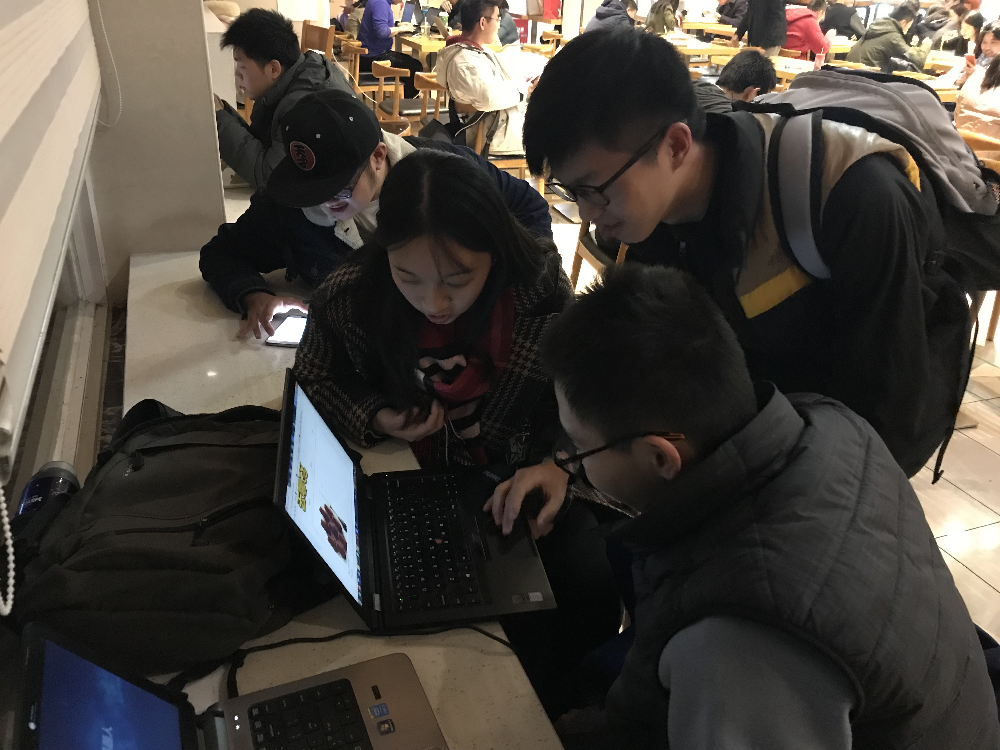
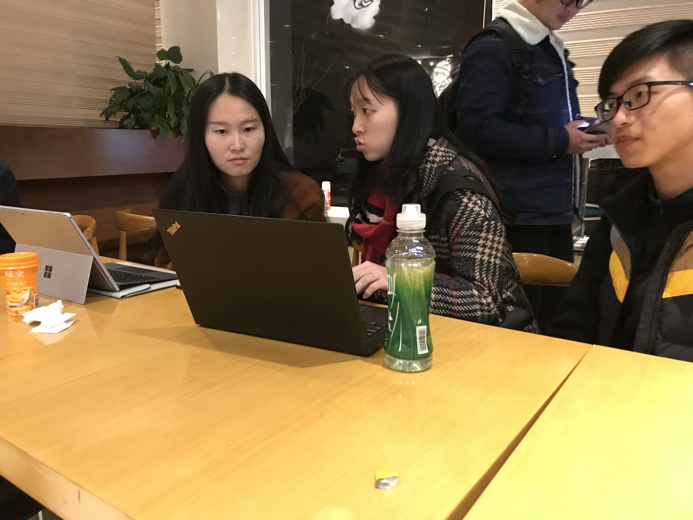

# 12月24日采访报告

本小组在1.2版本完成之后使用该版本的进行了一次市场调研，我们来到了二餐西餐厅进行对部分正在用餐的同学进行了采访，向他们展示了我们产品现有的功能和正在设计过程中的功能，下面是其中三位同学的采访报告。

###男同学1

年级：大三

####对现有产品的反馈：

- 应当展示该窗口的楼层和具体位置，而不仅仅是一个菜品的展示

####新功能的期望

- 吃饭时间较晚，部分菜品已经售完，需要展示下菜品现在的准备情况
- 可能食堂排队的人比较少，但是座位确实非常满的，不好找座位

### 男同学2

年级：大三，主动表示在食堂吃饭的频率比较高

#### 对现有产品的反馈：

- 字体应该再大一些，有突出的感觉

#### 新功能的期望

- 可以考虑一下食堂的饮品方面的一个展示

### 女同学1

年级：研一

#### 对现有产品的反馈：

- 展示功能还是需要一个排序和搜索功能

#### 新功能的期望

- 无